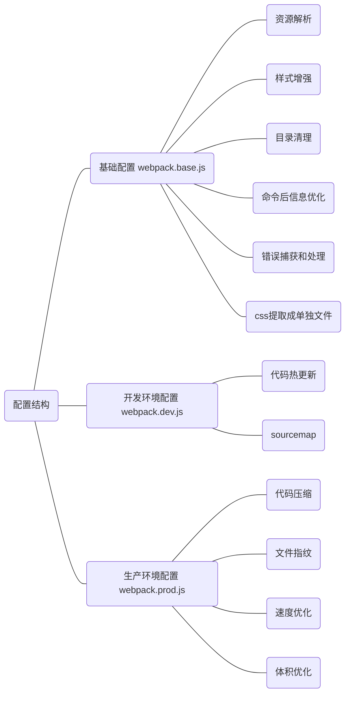

# webpack 构建工具配置结构

```mermaid
graph LR
A(配置结构) --- B1(基础配置 webpack.base.js)
    B1 --- B1C1(资源解析)
    B1 --- B1C2(样式增强)
    B1 --- B1C3(目录清理)
    B1 --- B1C4(命令后信息优化)
    B1 --- B1C5(错误捕获和处理)
    B1 --- B1C6(css提取成单独文件)
A --- B2(开发环境配置 webpack.dev.js)
    B2 --- B2C1(代码热更新)
    B2 --- B2C2(sourcemap)
A --- B3(生产环境配置 webpack.prod.js)
    B3 --- B3C1(代码压缩)
    B3 --- B3C2(文件指纹)
    B3 --- B3C3(速度优化)
    B3 --- B3C4(体积优化)
```
